# CIFAR-10 Image Classification — Deep Learning Project

<div align="center">


**A production-quality image classification system for autonomous vehicle perception, built with PyTorch.**  
Outperforms a commercial vendor baseline (Detectocorp, 70%) by over 24 percentage points.

[Overview](#-overview) · [Results](#-results) · [Architecture](#-architecture) · [Setup](#-setup--installation) · [Usage](#-usage) · [Benchmarks](#-benchmark-comparison) · [References](#-references)

</div>

---

## Overview

This project addresses a real-world **build-versus-buy** decision for a self-driving car startup. A commercial vendor (Detectocorp) offers an image classification algorithm achieving **70% accuracy** on the CIFAR-10 benchmark. This project demonstrates that an in-house team can build a significantly superior system using modern deep learning techniques in PyTorch.

Two models were developed and evaluated:

| Model | Strategy | Parameters | Test Accuracy | vs Detectocorp |
|---|---|---|---|---|
| **CIFARNet** | Custom CNN from scratch | 2.8M | **93.43%** | +23.43 pts |
| **ResNet-50 (fine-tuned)** | Transfer learning from ImageNet | 23.5M | **94.62%** | +24.62 pts |

**Recommendation: Build in-house.** Both models dramatically outperform the commercial offering, provide full architectural transparency, eliminate recurring licensing costs, and establish a foundation for continuous improvement on proprietary road imagery.

---

## Project Structure

```
cifar-10-image-classifier/
│
├── CIFAR-10_Image_Classifier_COMPLETE.ipynb   # Main notebook (all code)
├── README.md                                   # This file
├── CIFAR10_Project_Report.docx                 # Full technical report
│
├── data/                                       # Auto-downloaded CIFAR-10 dataset
│   └── cifar-10-python.tar.gz
│
├── saved_models/
│   ├── cifar10_cifarnet.pth                   # CIFARNet weights
│   └── cifar10_resnet50_finetuned.pth         # Fine-tuned ResNet-50 weights
│
└── outputs/
    ├── training_curves.png                     # CIFARNet loss & accuracy plots
    └── transfer_learning_curves.png            # ResNet-50 training curves
```

---

## Results

### Training Progression — CIFARNet (30 epochs)

| Epoch | Avg Loss | Test Accuracy |
|---|---|---|
| 1 | 1.7912 | 43.89% |
| 5 | 0.8192 | 67.17% |
| 10 | 0.5639 | 79.63% |
| 15 | 0.4341 | 83.82% |
| 20 | 0.3161 | 88.59% |
| 25 | 0.1778 | 91.68% |
| **30** | **0.1066** | **93.40%** |

### Transfer Learning Progression — ResNet-50

**Stage 1 — Head Only (5 epochs, backbone frozen):**

| Epoch | Loss | Train Acc | Test Acc |
|---|---|---|---|
| 1 | 1.1654 | 62.13% | 82.05% |
| 3 | 0.9110 | 68.81% | 83.88% |
| 5 | 0.8901 | 69.35% | 83.25% |

**Stage 2 — Full Fine-Tuning (15 epochs, all layers unfrozen):**

| Epoch | Loss | Train Acc | Test Acc |
|---|---|---|---|
| 1 | 0.8295 | 71.66% | 85.23% |
| 5 | 0.4012 | 86.26% | 91.98% |
| 10 | 0.2825 | 90.55% | 94.08% |
| **15** | **0.2557** | **91.38%** | **94.55%** |

### Per-Class Accuracy

| Class | CIFARNet | ResNet-50 | Difficulty |
|---|---|---|---|
| ✈️ Airplane | 94.80% | 94.60% | Easy |
| 🚗 Automobile | 96.90% | **97.70%** | Easy |
| 🐦 Bird | 90.50% | 92.90% | Moderate |
| 🐱 Cat | 86.30% | 88.20% | **Hardest** |
| 🦌 Deer | 94.00% | 93.90% | Easy |
| 🐶 Dog | 88.80% | 91.90% | Hard |
| 🐸 Frog | **96.20%** | 95.60% | Easy |
| 🐴 Horse | 95.10% | 96.50% | Easy |
| 🚢 Ship | 96.10% | 97.40% | Easy |
| 🚛 Truck | 95.30% | **96.80%** | Easy |

> Cat and dog are the most challenging classes due to shared morphological features at 32×32 resolution — a known, documented limitation of the dataset.

---

## Architecture

### Data Science Pipeline

The complete end-to-end data science flow for both models is illustrated below. Each colour group represents a distinct phase of the pipeline.

```mermaid
flowchart TD
    %% ═══════════════════════════════════════════════════
    %%  COLOR PALETTE DEFINITIONS
    %% ═══════════════════════════════════════════════════
    classDef dataClass      fill:#1a6b3c,stroke:#0d3d22,color:#ffffff,rx:8
    classDef prepClass      fill:#1565C0,stroke:#0d47a1,color:#ffffff,rx:8
    classDef augClass       fill:#6A1B9A,stroke:#4A148C,color:#ffffff,rx:8
    classDef cifarnetClass  fill:#E65100,stroke:#BF360C,color:#ffffff,rx:8
    classDef resnetClass    fill:#880E4F,stroke:#560027,color:#ffffff,rx:8
    classDef trainClass     fill:#1B5E20,stroke:#003300,color:#ffffff,rx:8
    classDef evalClass      fill:#4E342E,stroke:#3E2723,color:#ffffff,rx:8
    classDef outputClass    fill:#263238,stroke:#000a12,color:#ffffff,rx:8
    classDef decisionClass  fill:#F57F17,stroke:#E65100,color:#000000,rx:8
    classDef subgraphStyle  fill:#f0f4f8,stroke:#ccc

    %% ═══════════════════════════════════════════════════
    %%  PHASE 1 — DATA INGESTION
    %% ═══════════════════════════════════════════════════
    subgraph INGEST ["📦  PHASE 1 · DATA INGESTION"]
        direction TB
        D1["🗄️ CIFAR-10 Dataset\n60,000 images · 10 classes\n50k train / 10k test\n32×32 RGB · balanced"]
        D2["📁 torchvision.datasets\nCIFAR10(download=True)\nAuto-cached to ./data/"]
        D1 --> D2
    end

    %% ═══════════════════════════════════════════════════
    %%  PHASE 2 — PREPROCESSING FORK
    %% ═══════════════════════════════════════════════════
    subgraph PREP ["🔧  PHASE 2 · PREPROCESSING"]
        direction LR
        P1["🔵 CIFARNet Pipeline\n32×32 input preserved\nNorm: CIFAR-10 stats\nmean=[0.491,0.482,0.446]\nstd=[0.202,0.199,0.201]"]
        P2["🔴 ResNet-50 Pipeline\nResize 32→224 px\nNorm: ImageNet stats\nmean=[0.485,0.456,0.406]\nstd=[0.229,0.224,0.225]"]
    end

    %% ═══════════════════════════════════════════════════
    %%  PHASE 3 — DATA AUGMENTATION
    %% ═══════════════════════════════════════════════════
    subgraph AUG ["🎨  PHASE 3 · DATA AUGMENTATION  (train split only)"]
        direction LR
        A1["↔️ RandomHorizontalFlip\np = 0.50"]
        A2["✂️ RandomCrop\npad=4 (CIFARNet)\npad=28 (ResNet-50)"]
        A3["🌈 ColorJitter\nbright/contrast/sat ±20-30%\nhue ±10% (ResNet-50)"]
        A4["🔄 RandomRotation\n±15 degrees"]
        A1 --> A2 --> A3 --> A4
    end

    %% ═══════════════════════════════════════════════════
    %%  PHASE 4a — CIFARNet ARCHITECTURE
    %% ═══════════════════════════════════════════════════
    subgraph CIFARNET ["🟠  PHASE 4a · CIFARNet  (Custom CNN · 2.8M params)"]
        direction TB
        C1["🌱 Stem\nConv2d(3→64, k=3, pad=1)\nBatchNorm2d · ReLU\nOutput: 64×32×32"]
        C2["📦 Stage 1 · 2× ResidualBlock\n64 channels · stride=1\nOutput: 64×32×32"]
        C3["📦 Stage 2 · 2× ResidualBlock\n64→128 channels · stride=2\nOutput: 128×16×16"]
        C4["📦 Stage 3 · 2× ResidualBlock\n128→256 channels · stride=2\nOutput: 256×8×8"]
        C5["🎯 Classifier Head\nGlobalAvgPool → 256-d\nDropout(p=0.3)\nLinear(256→10)\nlog_softmax"]
        C1 --> C2 --> C3 --> C4 --> C5
    end

    %% ═══════════════════════════════════════════════════
    %%  PHASE 4b — ResNet-50 ARCHITECTURE
    %% ═══════════════════════════════════════════════════
    subgraph RESNET ["🟣  PHASE 4b · ResNet-50  (Transfer Learning · 23.5M params)"]
        direction TB
        R1["🏋️ ImageNet Pretrained\nINAGENET1K_V2\n80.85% top-1 accuracy\n1.2M training images"]
        R2["❄️ Stage 1 · Freeze Backbone\n99.9% params frozen\nTrain head only (0.1%)\nAdam · lr=1e-3 · 5 epochs"]
        R3["🔓 Stage 2 · Unfreeze All\n23.5M params trainable\nDiff LR: backbone 1e-4\nhead 1e-3 · 15 epochs"]
        R4["🎯 New Classifier Head\nDropout(p=0.4)\nLinear(2048→10)\nCrossEntropyLoss"]
        R1 --> R2 --> R3 --> R4
    end

    %% ═══════════════════════════════════════════════════
    %%  PHASE 5 — TRAINING CONFIGURATION
    %% ═══════════════════════════════════════════════════
    subgraph TRAIN ["⚙️  PHASE 5 · TRAINING CONFIGURATION"]
        direction LR
        T1["🔵 CIFARNet Settings\nOptimiser: SGD\nmomentum=0.9\nweight_decay=5e-4\nlr=0.1 → 0\nScheduler: CosineAnnealing\nEpochs: 30\nBatch: 128"]
        T2["🔴 ResNet-50 Settings\nS1: Adam lr=1e-3\nS2: SGD momentum=0.9\nweight_decay=1e-4\nScheduler: OneCycleLR\nTotal epochs: 20\nBatch: 64"]
        T3["🛡️ Regularisation\nBatch Normalisation\nDropout (0.3 / 0.4)\nL2 weight decay\nData augmentation\nGlobal Average Pool"]
    end

    %% ═══════════════════════════════════════════════════
    %%  PHASE 6 — EVALUATION
    %% ═══════════════════════════════════════════════════
    subgraph EVAL ["📊  PHASE 6 · EVALUATION"]
        direction TB
        E1["🧮 Overall Test Accuracy\nCIFARNet:  93.43%\nResNet-50: 94.62%\nDetectocorp: 70.00%"]
        E2["🔍 Per-Class Analysis\n10-class breakdown\nCat/Dog hardest\nAuto/Ship easiest"]
        E3["📈 Training Curves\nLoss per epoch\nVal accuracy per epoch\nLR schedule overlay"]
        E1 --> E2 --> E3
    end

    %% ═══════════════════════════════════════════════════
    %%  PHASE 7 — OUTPUT & DECISION
    %% ═══════════════════════════════════════════════════
    subgraph OUTPUT ["💾  PHASE 7 · OUTPUT & DECISION"]
        direction LR
        O1["💽 Saved Artifacts\ncifar10_cifarnet.pth\ncifar10_resnet50_finetuned.pth\ntraining_curves.png"]
        O2["✅ Recommendation\nBUILD IN-HOUSE\n+24.6 pts vs Detectocorp\nFull IP ownership\nTransfer-learning ready"]
        O3["🚀 Future Pipeline\nFine-tune on road imagery\nObject detection (YOLO)\nEmbedded deployment\nKnowledge distillation"]
    end

    %% ═══════════════════════════════════════════════════
    %%  CONNECTIONS BETWEEN PHASES
    %% ═══════════════════════════════════════════════════
    D2 --> P1 & P2
    P1 --> A1
    P2 --> A1
    A4 --> C1
    A4 --> R1
    C5 --> E1
    R4 --> E1
    T1 -.->|configures| C1
    T2 -.->|configures| R2
    T3 -.->|regularises| C5
    T3 -.->|regularises| R4
    E3 --> O1
    O1 --> O2 --> O3

    %% ═══════════════════════════════════════════════════
    %%  APPLY CLASSES
    %% ═══════════════════════════════════════════════════
    class D1,D2 dataClass
    class P1,P2 prepClass
    class A1,A2,A3,A4 augClass
    class C1,C2,C3,C4,C5 cifarnetClass
    class R1,R2,R3,R4 resnetClass
    class T1,T2,T3 trainClass
    class E1,E2,E3 evalClass
    class O1,O2,O3 outputClass
```



#### Colour Legend

| Colour | Phase | Description |
|---|---|---|
| 🟢 **Dark Green** | Data Ingestion | CIFAR-10 loading via torchvision |
| 🔵 **Royal Blue** | Preprocessing | Normalisation pipelines (CIFAR-10 / ImageNet stats) |
| 🟣 **Deep Purple** | Data Augmentation | Stochastic transforms applied at training time |
| 🟠 **Deep Orange** | CIFARNet | Custom residual CNN built from scratch |
| 🩷 **Dark Pink** | ResNet-50 | Transfer learning from ImageNet pretrained weights |
| 🌲 **Forest Green** | Training Config | Optimisers, schedulers, regularisation |
| 🟤 **Brown** | Evaluation | Accuracy metrics, per-class analysis, curves |
| ⬛ **Dark Slate** | Output & Decision | Saved models, build recommendation, future roadmap |

---

### CIFARNet — Layer-by-Layer Detail

```
Input: 3 × 32 × 32
       │
       ▼
┌─────────────────────────────────────────────┐
│  STEM                                       │
│  Conv2d(3→64, kernel=3, pad=1, bias=False) │
│  BatchNorm2d(64) → ReLU                    │
│  Output: 64 × 32 × 32                      │
└─────────────────────────────────────────────┘
       │
       ▼
┌─────────────────────────────────────────────┐
│  STAGE 1  ×2 ResidualBlock(64→64)          │
│  [Conv3×3→BN→ReLU→Conv3×3→BN] + skip      │
│  Output: 64 × 32 × 32                      │
└─────────────────────────────────────────────┘
       │
       ▼
┌─────────────────────────────────────────────┐
│  STAGE 2  ×2 ResidualBlock(64→128)         │
│  Blk1: stride=2 (↓ spatial, ↑ channels)   │
│  Shortcut: Conv1×1(64→128, stride=2)       │
│  Output: 128 × 16 × 16                     │
└─────────────────────────────────────────────┘
       │
       ▼
┌─────────────────────────────────────────────┐
│  STAGE 3  ×2 ResidualBlock(128→256)        │
│  Blk1: stride=2 (↓ spatial, ↑ channels)   │
│  Shortcut: Conv1×1(128→256, stride=2)      │
│  Output: 256 × 8 × 8                       │
└─────────────────────────────────────────────┘
       │
       ▼
┌─────────────────────────────────────────────┐
│  CLASSIFIER HEAD                            │
│  AdaptiveAvgPool2d(1) → [256]              │
│  Dropout(p=0.3)                            │
│  Linear(256 → 10)                          │
│  log_softmax(dim=1)                        │
└─────────────────────────────────────────────┘
       │
       ▼
Output: log-probabilities [batch × 10]
```

**Total parameters:** 2,777,674 · **Final accuracy:** 93.43%

---

### ResNet-50 Fine-Tuning Strategy

```
ImageNet Pretrained ResNet-50
(IMAGENET1K_V2 · 80.85% top-1)
         │
         ▼
  ┌──────────────┐
  │  Stage 1     │  Freeze 99.9% of params
  │  5 epochs    │  Train head only
  │  Adam 1e-3   │  → 83.25% test accuracy
  └──────────────┘
         │
         ▼
  ┌──────────────┐
  │  Stage 2     │  Unfreeze all 23.5M params
  │  15 epochs   │  Backbone LR: 1e-4
  │  SGD + OC LR │  Head LR:     1e-3
  └──────────────┘  → 94.62% test accuracy

  Head: Dropout(0.4) → Linear(2048 → 10)
```

---

## Setup & Installation

### Prerequisites

- Python 3.9+
- pip or conda
- NVIDIA GPU recommended (CUDA 11.8+); CPU training is supported but slow

### 1 — Clone / unzip the project

```bash
unzip cifar-10-image-classifier-starter.zip
cd cifar-10-image-classifier
```

### 2 — Create a virtual environment

```bash
# conda (recommended)
conda create -n cifar10 python=3.9 -y
conda activate cifar10

# OR venv
python -m venv .venv && source .venv/bin/activate  # macOS/Linux
python -m venv .venv && .venv\Scripts\activate     # Windows
```

### 3 — Install dependencies

```bash
# GPU (CUDA 11.8)
pip install torch torchvision --index-url https://download.pytorch.org/whl/cu118

# CPU only
pip install torch torchvision

# Other dependencies
pip install jupyter matplotlib numpy
```

### 4 — Launch the notebook

```bash
jupyter notebook CIFAR-10_Image_Classifier_COMPLETE.ipynb
```

Then: **Kernel → Restart & Run All**

CIFAR-10 (~170 MB) downloads automatically into `./data/` on first run.

---

## Usage

### Running the Full Pipeline

Open `CIFAR-10_Image_Classifier_COMPLETE.ipynb` and run all cells in order. The notebook is fully self-contained:

| Cell | Description |
|---|---|
| 1 | Imports |
| 2 | Load & preprocess CIFAR-10 data |
| 3 | `show5()` helper for visualisation |
| 4 | Explore dataset (shapes, distribution, sample images) |
| 5 | Define `ResidualBlock` and `CIFARNet` |
| 6 | Instantiate model, loss, optimiser, scheduler |
| 7 | Train CIFARNet for 30 epochs |
| 8 | Plot training loss & validation accuracy curves |
| 9 | Evaluate CIFARNet (overall + per-class accuracy) |
| 10 | Save / reload CIFARNet weights |
| 11–18 | Transfer learning: ResNet-50 setup → Stage 1 → Stage 2 → evaluate → save |

### Loading a Saved Model for Inference

```python
import torch
import torch.nn as nn

# ── CIFARNet ──────────────────────────────────────────────────────────────
from your_notebook import CIFARNet, ResidualBlock   # or copy class definitions

model = CIFARNet(num_classes=10)
model.load_state_dict(torch.load('cifar10_cifarnet.pth', map_location='cpu'))
model.eval()

# ── ResNet-50 ─────────────────────────────────────────────────────────────
import torchvision.models as models

resnet = models.resnet50(weights=None)
resnet.fc = nn.Sequential(nn.Dropout(p=0.4), nn.Linear(2048, 10))
resnet.load_state_dict(torch.load('cifar10_resnet50_finetuned.pth', map_location='cpu'))
resnet.eval()

# ── Single-image inference ─────────────────────────────────────────────────
classes = ('plane','car','bird','cat','deer','dog','frog','horse','ship','truck')

with torch.no_grad():
    logits = model(image_tensor.unsqueeze(0))   # [1, 10]
    pred   = logits.argmax(dim=1).item()
    print(f'Predicted class: {classes[pred]}')
```

---

## Benchmark Comparison

| Model | Authors | Year | Test Accuracy |
|---|---|---|---|
| Detectocorp *(commercial baseline)* | Vendor | — | 70.0% |
| Deep Belief Networks | Krizhevsky | 2010 | 78.9% |
| Maxout Networks | Goodfellow et al. | 2013 | 90.6% |
| **CIFARNet** *(this project)* | In-house | 2026 | **93.43%** |
| **ResNet-50 Fine-tuned** *(this project)* | In-house | 2026 | **94.62%** |
| Wide Residual Networks | Zagoruyko et al. | 2016 | 96.0% |
| Rethinking RNNs | Nguyen et al. | 2020 | 98.5% |
| GPipe | Huang et al. | 2018 | 99.0% |

Both in-house models exceed the Detectocorp baseline by **>23 percentage points** and surpass academic benchmarks from 2013, using a fraction of the compute budget of frontier models.

---

## Key Techniques

### Data Augmentation (4 transforms)
- **RandomHorizontalFlip** — `p=0.5`
- **RandomCrop** — 4px padding (CIFARNet) / 28px at 224×224 (ResNet-50)
- **ColorJitter** — brightness, contrast, saturation ±20–30%
- **RandomRotation** — ±15 degrees

### CIFARNet Innovations
- **Residual skip connections** — prevent vanishing gradients through depth
- **Batch Normalisation** — after every Conv2d for training stability
- **Global Average Pooling** — replaces large FC layers; fewer parameters
- **Cosine Annealing LR** — smooth decay from 0.1 → 0 over 30 epochs
- **SGD + momentum + weight decay** — L2 regularisation built into optimiser

### Transfer Learning Innovations
- **Two-stage protocol** — head-only warmup (Stage 1) then full fine-tune (Stage 2)
- **Differential learning rates** — backbone `1e-4` vs head `1e-3`
- **OneCycleLR scheduler** — Leslie Smith's superconvergence policy (per-batch)
- **ImageNet initialisation** — IMAGENET1K_V2 checkpoint (80.85% top-1 on ImageNet)

---

## Training Time Estimates

| Environment | CIFARNet (30 ep) | ResNet-50 TL (20 ep) | Total |
|---|---|---|---|
| iMac CPU (i5 6-core) | ~40 min | ~3–4 hrs ⚠️ | ~4+ hrs |
| Google Colab T4 GPU | ~10 min | ~25 min | ~35–45 min |
| Udacity Workspace K80 | ~20 min | ~40 min | ~60–80 min |

> **Tip:** Use GPU mode only for training cells. Switch to CPU for data loading, EDA, and architecture checks to conserve your GPU quota.

---

## Limitations

1. **Low-resolution input** — CIFAR-10's 32×32 px is far below automotive camera resolution (1280×720+). Models need retraining on domain data before deployment.
2. **Closed-set classification** — Neither model can flag unknown object categories. Real-world deployment requires open-set recognition capability.
3. **Single training run** — Results reflect one random seed. True expected accuracy should be treated as a distribution (±1–2%).
4. **Hardware scale** — Frontier results (GPipe 99.0%) require pipeline-parallel training across hundreds of GPUs, beyond this project's scope.
5. **Static dataset** — No domain shift handling for varied weather, lighting, or camera perspectives encountered in real driving.

---

## Future Research Directions

- **Advanced architectures** — EfficientNet, Vision Transformers (ViT), DeiT for higher accuracy with better efficiency
- **Knowledge distillation** — Compress ResNet-50 (23.5M params) into CIFARNet-scale model for embedded deployment
- **Domain adaptation** — Fine-tune on proprietary road imagery collected from the vehicle fleet
- **Object detection** — Extend to YOLO / Faster R-CNN using the ResNet-50 backbone as feature extractor
- **Uncertainty quantification** — Monte Carlo Dropout or Deep Ensembles for calibrated confidence in safety-critical decisions
- **Self-supervised pre-training** — SimCLR / MoCo on unlabelled road imagery before supervised fine-tuning

---

## Dependencies

```
torch>=2.0.0
torchvision>=0.15.0
matplotlib>=3.7.0
numpy>=1.24.0
jupyter>=1.0.0
```

Install all at once:

```bash
pip install torch torchvision matplotlib numpy jupyter
```

---

## References

1. Krizhevsky, A., Nair, V., & Hinton, G. (2009). *Learning multiple layers of features from tiny images.* University of Toronto Technical Report.
2. He, K., Zhang, X., Ren, S., & Sun, J. (2016). *Deep residual learning for image recognition.* CVPR, 770–778.
3. Goodfellow, I. J. et al. (2013). *Maxout networks.* ICML, PMLR 28, 1319–1327.
4. Zagoruyko, S., & Komodakis, N. (2016). *Wide residual networks.* BMVC. arXiv:1605.07146.
5. Huang, Y. et al. (2018). *GPipe: Efficient training of giant neural networks using pipeline parallelism.* NeurIPS 32.
6. Nguyen, P. et al. (2020). *Rethinking recurrent neural networks and other improvements for image classification.* arXiv:2007.15353.
7. Ioffe, S., & Szegedy, C. (2015). *Batch normalization.* ICML, PMLR 37, 448–456.
8. Srivastava, N. et al. (2014). *Dropout: A simple way to prevent neural networks from overfitting.* JMLR 15(1), 1929–1958.
9. Smith, L. N., & Topin, N. (2018). *Super-convergence: Very fast training of neural networks using large learning rates.* SPIE 11006.
10. Tan, M., & Le, Q. (2019). *EfficientNet: Rethinking model scaling for convolutional neural networks.* ICML, PMLR 97, 6105–6114.
11. Dosovitskiy, A. et al. (2020). *An image is worth 16×16 words: Transformers for image recognition at scale.* arXiv:2010.11929.
12. Paszke, A. et al. (2019). *PyTorch: An imperative style, high-performance deep learning library.* NeurIPS 32.

---

## License

This project is released under the **MIT License**. See `LICENSE` for details.

---

<div align="center">


*Built with PyTorch · CIFAR-10 · Transfer Learning*

**Verdict: Build in-house. 🏆**  
*CIFARNet: 93.43% · ResNet-50: 94.62% · Detectocorp: 70.00%*

</div>
